# VM Health Monitoring with Ansible


## Overview

This project provides a fully automated solution for monitoring the
health of AWS EC2 instances using Ansible. It leverages Dynamic
Inventory to automatically discover instances, collects vital system
metrics (CPU, RAM, Disk), and sends formatted HTML email alerts
detailing the health status of your infrastructure.

### Key Features

- Dynamic Discovery: Automatically finds EC2 instances tagged with
  Environment=dev.

- Automated Setup: Scripts to tag instances and inject SSH keys.

- Health Metrics: Monitors CPU, Memory, and Disk usage.

- Reporting: Sends visual HTML email reports with health status badges.

## Prerequisites

- OS: Ubuntu 20.04/22.04 (Control Node)

- AWS Account: With access to create/read EC2 instances.

- IAM User: With Programmatic Access (Access Key & Secret Key).

- SSH Key Pair: A .pem file valid for the target instances.

## Part 1: System Installation & Setup

Perform these steps on your Ansible Control Node.

### 1.1 Creating Virtual Machines (EC2 Instances)

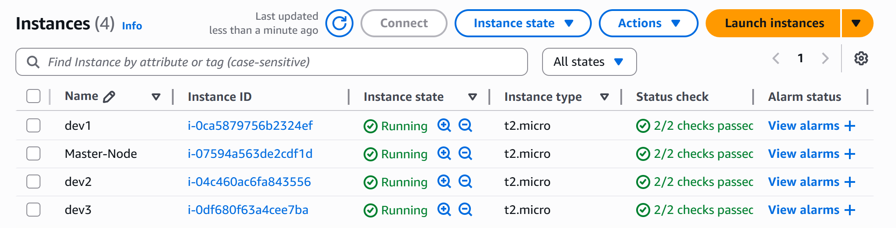

In this setup, Master-Node VM is my Control node and others are my managed nodes.

**For managed nodes give tagging "Environment = dev"**

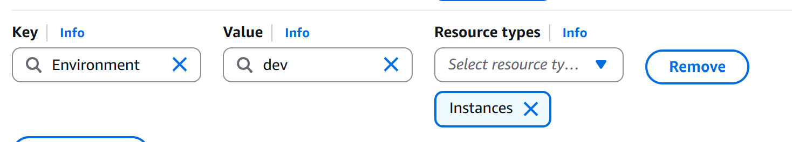

**Inbound rules for Master-node (Control-node)**

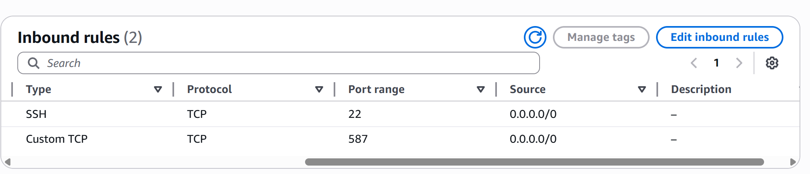

**Inbound rules for Managed Nodes**

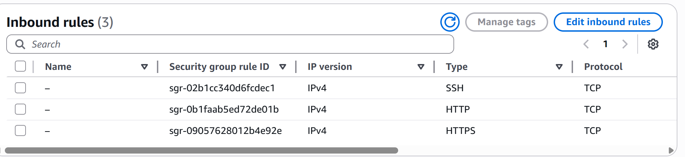

### 1.2 Connecting to Master Node, Update System & Install Ansible

Update the package repositories and install the official Ansible PPA for the latest version.


```bash
sudo apt update && sudo apt upgrade -y
sudo apt install software-properties-common -y
sudo add-apt-repository --yes --update ppa:ansible/ansible
sudo apt install ansible -y
```

### 1.3 Install AWS CLI

The AWS CLI is required for the dynamic inventory plugin to interact with the AWS API.


```bash
curl "https://awscli.amazonaws.com/awscli-exe-linux-x86_64.zip" -o "awscliv2.zip"
sudo apt install unzip
unzip awscliv2.zip
sudo ./aws/install
aws --version
```

### 1.4 Configure AWS Credentials

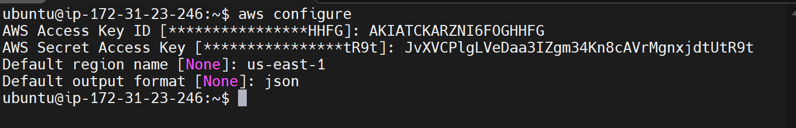

### 1.5 Set Up Python Environment

Ansible requires specific Python libraries (boto3, botocore) to talk to AWS. We will use a virtual environment to keep the system clean.

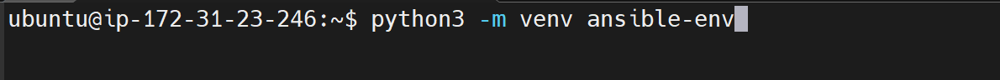

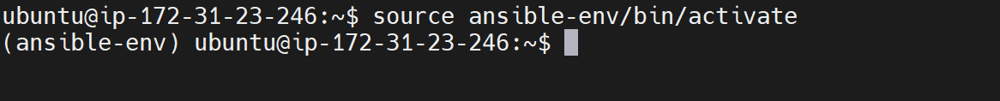


## Part 2: Project Configuration

Create the project structure and configuration files.

### 2.1 Project Directory Structure

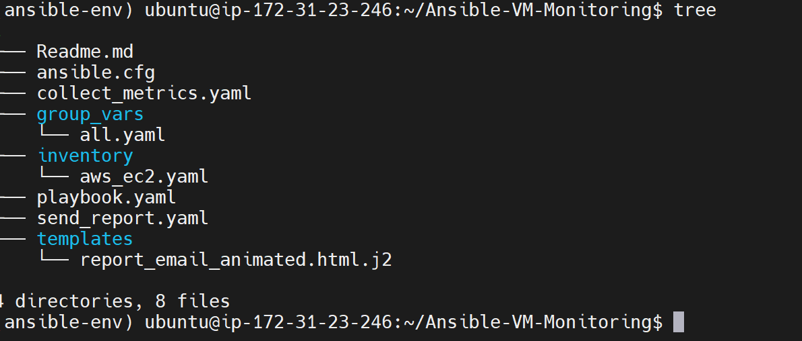

### 2.2 Ansible Configuration (ansible.cfg)

Create ansible.cfg in the project root. This tells Ansible to use the dynamic inventory and ignore host key checking (essential for cloud environments).

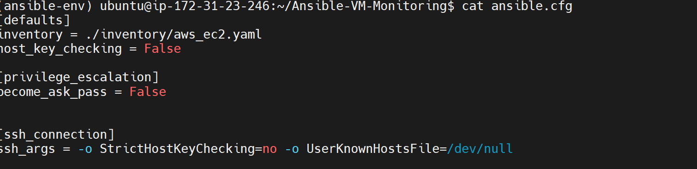

### 2.3 Dynamic Inventory (inventory/aws_ec2.yaml)

This file defines how Ansible finds your EC2 instances.

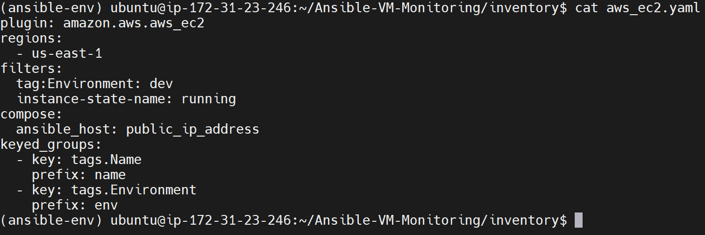

## Part 3: Infrastructure Preparation

Before running the monitoring playbooks, we need to prepare the AWS
instances.

### 3.1 Tag EC2 Instances

Run this script to verify your instances are running and assign them
sequential names (e.g .web-01, web-02).

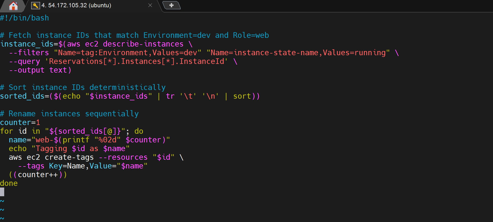{width="7.59375in"
height="4.932292213473316in"}

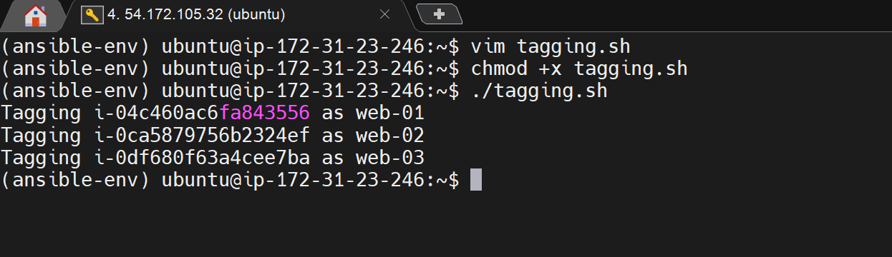{width="7.1875in"
height="1.7760422134733158in"}

### 3.2 Inject SSH Keys

This script uses the dynamic inventory to find the public IPs and copies
your local SSH public key to the remote servers, allowing passwordless
Ansible execution.


**Giving execution permission to the script:**


```bash
chmod +x scripts/copy-publickey.sh
```

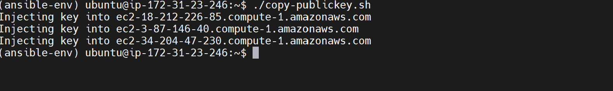

## Part 4: Creating Playbook Files

### 4.1 collect_metrics.yml

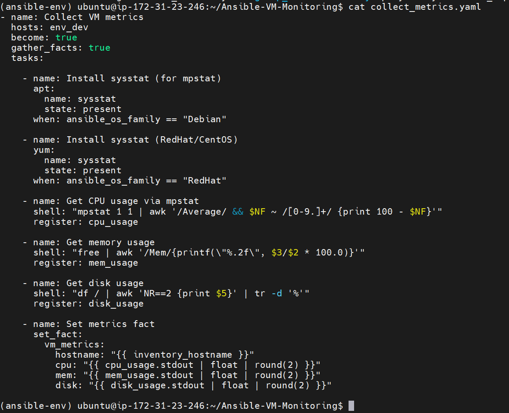

### 4.2 send_report.yml

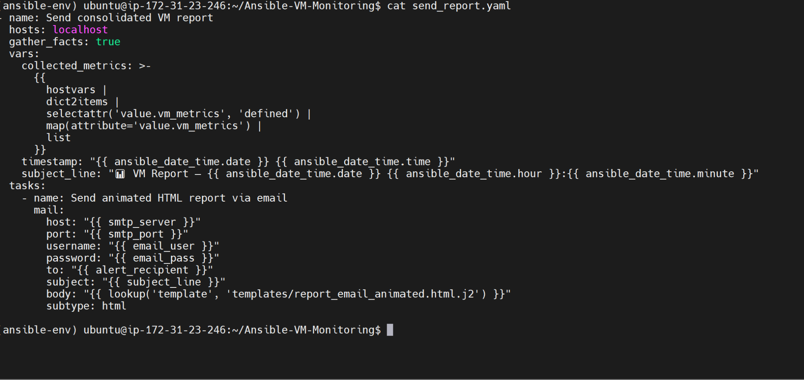

### 4.3 group_vars/all.yml

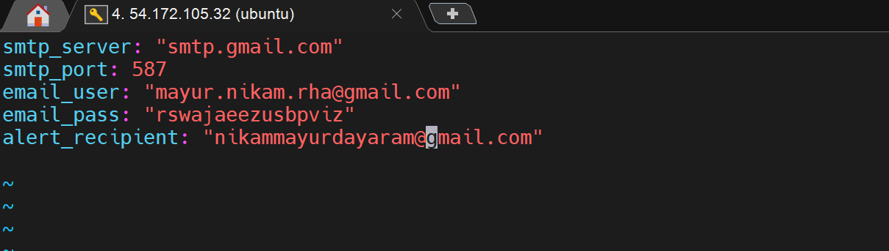

### 4.4 playbook.yml


## Part 5: Running the Monitor

### 5.1 Verify with "--check"

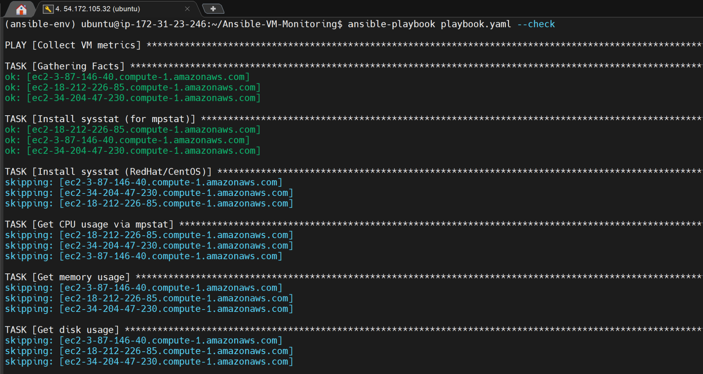

### 5.2 Running the Playbook

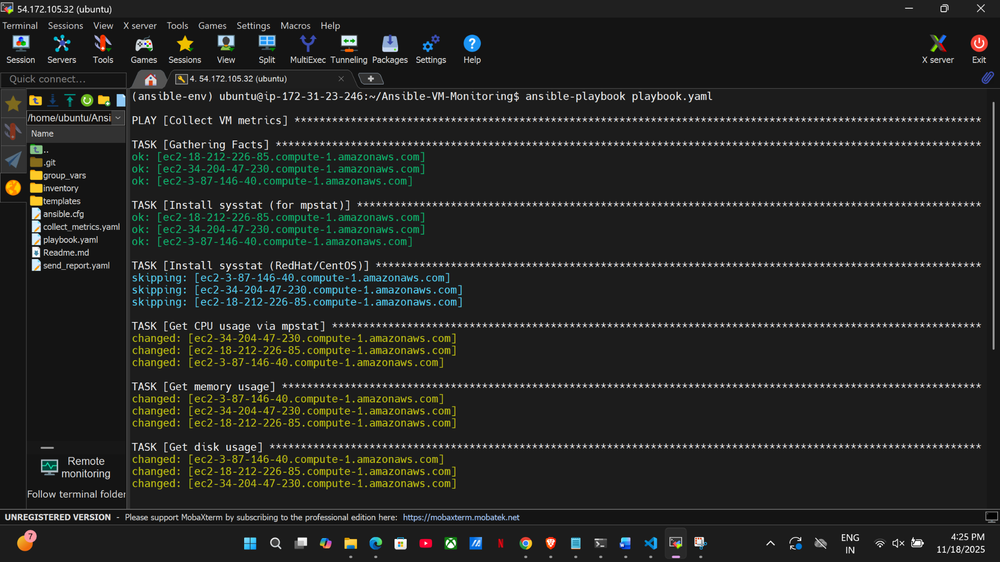

## Part 6: Email Report

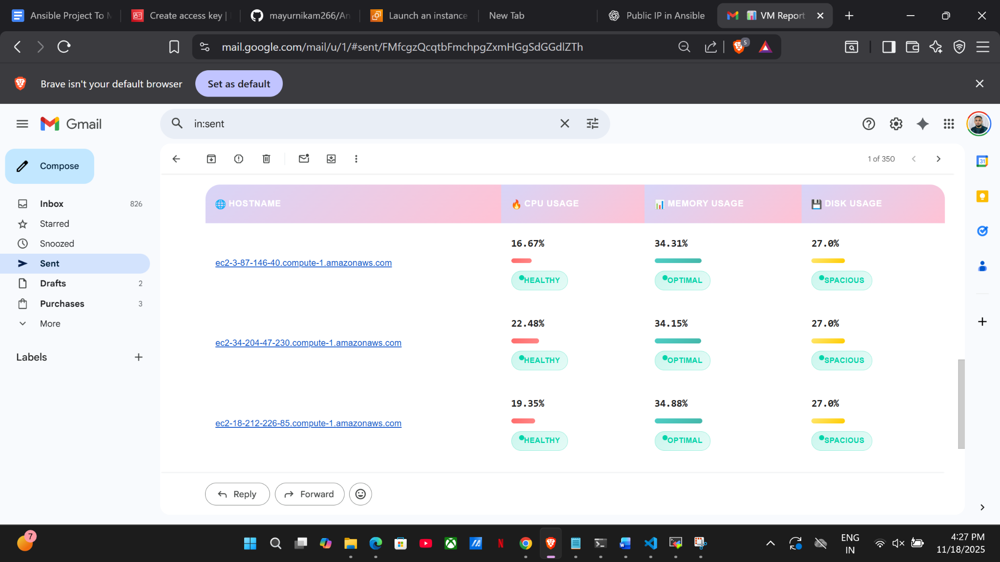

## Troubleshooting

| Issue | Solution |
|-------|----------|
| boto3 not found | Ensure you activated the virtual env: `source ansible-env/bin/activate` |
| Permission Denied (Public Key) | Run `copy-publickey.sh` again. Ensure your local id_rsa.pub exists. |
| No hosts found | Check AWS Console. Ensure instances have tag Environment: dev and are Running. |
| Email Authentication Failed | If using Gmail, ensure you are using an App Password, not your login password. |
